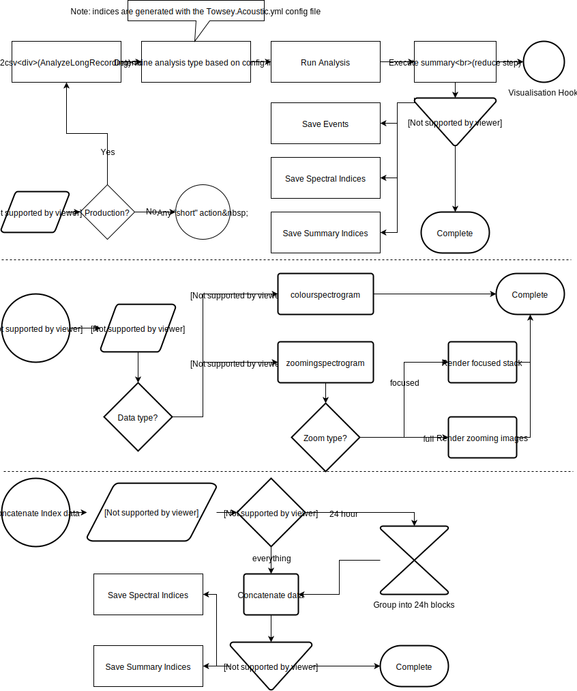

# Code Paths

[INCOMPLETE]

**IAnalyzer\[2\]**

IAnalyzer2 is a pattern code must adhere to in order to be run by audio2csv. audio2csv is our mass, parallel, analysis runner that is used to analyze very long files.

It is common for each analysis type to have **both** a *development sub-program type* which is used for testing and an *IAnalyzer* implementation which is used in production.

For example, the canetoad recognizer has:

-   Sub-program type: canetoad (for short testing recordings, &lt;2min)

-   $ AnalysisPrograms.exe canetoad ... -&gt; CanetoadOld.Execute -&gt; CanetoadOld.Analysis -&gt; RhinellaMarina.Analysis

-   audio2csv + IAnalyzer: Rhinella.Marina (for very long files, &gt;2min)

-   $ AnalysisPrograms.exe audio2csv ... -c Rhinella.Marina.yml ...-&gt; AnalyseLongRecording.Execute -&gt; RhinellaMarina.Analysis

**Note:** All event recognizers are run through a generic *sub-program* named *eventrecognizer*

-   eventrecognizer + IAnalyzer: Rhinella.Marina (for short testing recordings, &lt;2min)

-   $ AnalysisPrograms.exe eventrecognizer ... -c Rhinella.Marina.yml ... -&gt; RecognizerEntry.Execute -&gt; RecognizerBase.Analysis -&gt; RhinellaMarina.Analysis